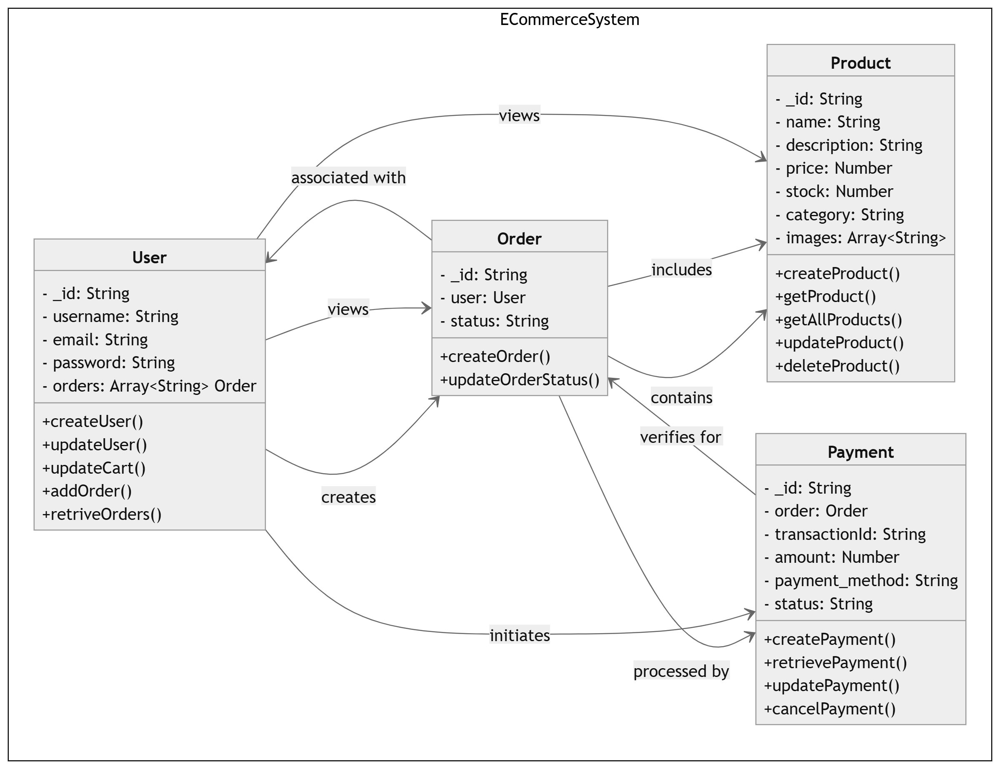

## Folder Structure

The folder is organized into the following main directories:

- `Part1-System_Design/`: Contains the system design, including models and controllers
- `Part2-Business_Logic_Implementation/`: Implements core business logic functions
- `Part3-Database_Query_Handling/`: Contains SQL queries for database operations

**Note: Each folder has its own README file with more details about the implementation.**

## Part 1: System Design

### Models

1. User Model
2. Product Model
3. Order Model
4. Payment Model

### Controllers

1. User Controller
2. Product Controller
3. Order Controller
4. Payment Controller

### Class Diagram

## Part 2: Business Logic Implementation

This part contains the core business logic for inventory management, including:

- `process_orders()`: Processes orders and updates stock levels
- `restock_items()`: Restocks items in the inventory

## Part 3: Database Query Handling

This part includes SQL queries for various database operations, such as:

- Retrieving top customers
- Calculating total revenue by author
- Retrieving frequently ordered books

# How to Run

1. For Part 1 (System Design): Review the models and controllers in the respective directories.
2. For Part 2 (Business Logic):
   - Navigate to the `Part2-Business_Logic_Implementation` directory
   - Run `node index.js` or `node Part2-Business_Logic_Implementation/index.js` in the root directory
3. For Part 3 (Database Queries):
   - Ensure you have access to a MySQL database
   - Execute the queries in `Part3-Database_Query_Handling/database-script.sql`

## Assumptions

- The system uses MongoDB for data storage in Part 1
- Node.js is used for implementing business logic in Part 2
- MySQL is used for database operations in Part 3

Please refer to the README files in each part's directory for more detailed information.

Thank you for your time and consideration. :-D